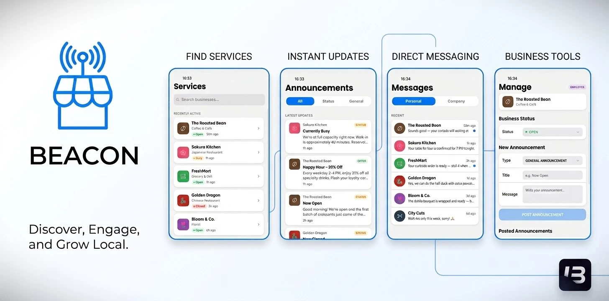

# Beacon (lb-phone Addon App)

Beacon is an open-source custom app for lb-phone on FiveM. It provides a localized business directory, real-time announcements, direct customer messaging, and in-app management tools for player-owned businesses.

---

## 🚀 Installation Guide

> [!IMPORTANT]
> This resource **requires LB Phone** to function correctly along with a supported framework.
> **IF** using a custom / unsupported framework you'll need to add support in `bridge/standalone`.

1.  **Dependencies:** Ensure you have `LB-Phone` installed and running on your server.
2.  **Database Setup:** Execute the provided SQL file: `sql/tables.sql`
    * *Note:* If you encounter errors during table creation, please verify that you are using an up-to-date MariaDB version (v10.11.\* or newer is recommended).
3.  **Resource Deployment:**
    * Add the resource folder to your FiveM server's `resources` directory.
    * Add `start mps-beacon-app` to your `server.cfg`.
4.  **Resource Configuration:**
    * Configure the general application settings in `static/config.json`
    * List all the interested companies to be displayed in the application in `static/companies.json`
---

## 🙏 Credits

* 🎨 **UI Template:** [lb-scripts / lb-phone-app-template](https://github.com/lbphone/lb-phone-app-template)
* ⚙️ **TypeScript Boilerplate:** [Overextended / fivem-typescript-boilerplate](https://github.com/overextended/fivem-typescript-boilerplate)
